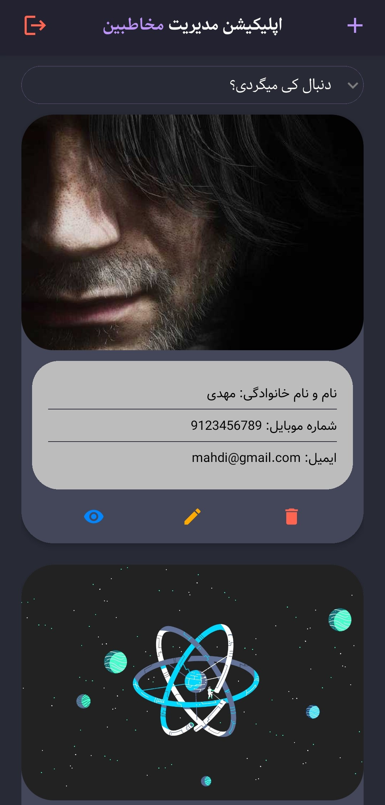
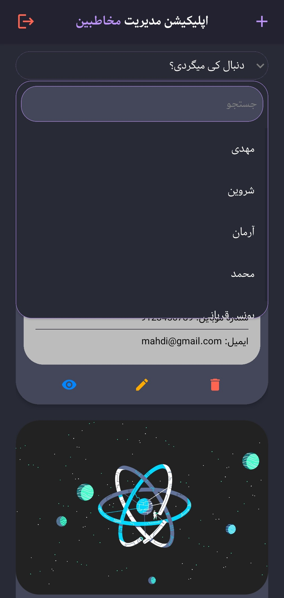
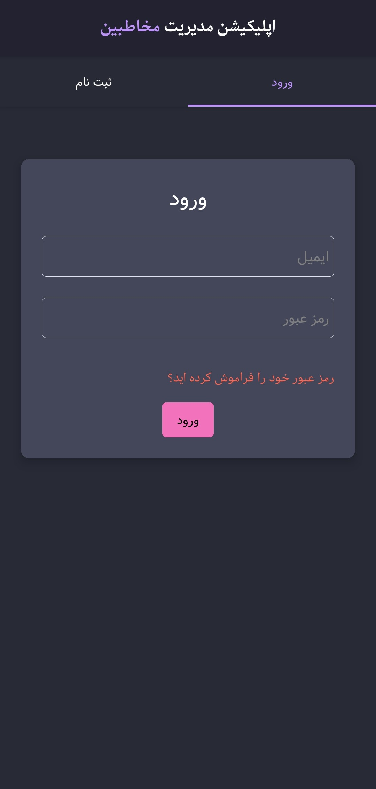

# Contact Manager mobile

#### save all of your contacts in a safe place forever and manage them easily with your phone. add photo for every user and manage the phone number and email addresses.

it's just a mobile version of [web contact manager](https://contact-manager-ecru.vercel.app) that is made by react native and 💖

## [Download Last Version](https://github.com/AlirezaAbd-dev/Contact-Manager-Mobile/releases/download/v1.0.21/Contact-Manager.apk)

[Web Contact Manager repository](https://github.com/AlirezaAbd-dev/Contact-Manager)

 

## Language and technologies that have been used

## Abilities

-  Able to signin and login
-  Able to see contacts list
-  Able to see contact details
-  Able to edit contact's info
-  Able to delete contact
-  Able to add image for every contact
-  Able to add phone number and email address for every contact

 
 
 

# Images

 

## Home Screen

 

## Search Section In Home Screen

 

## Signup Screen

 

## Add Contact Screen

 

## Edit Contact Screen

 

## Delete Contact Screen

